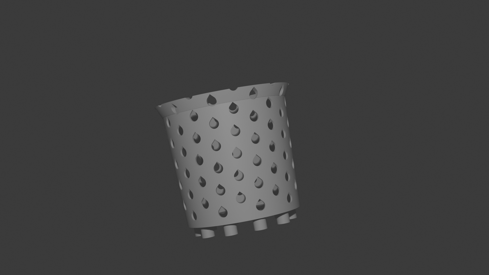
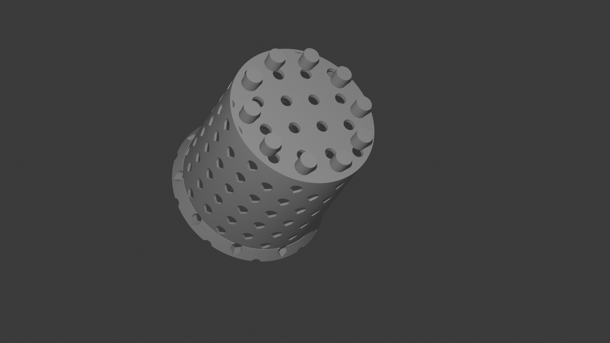
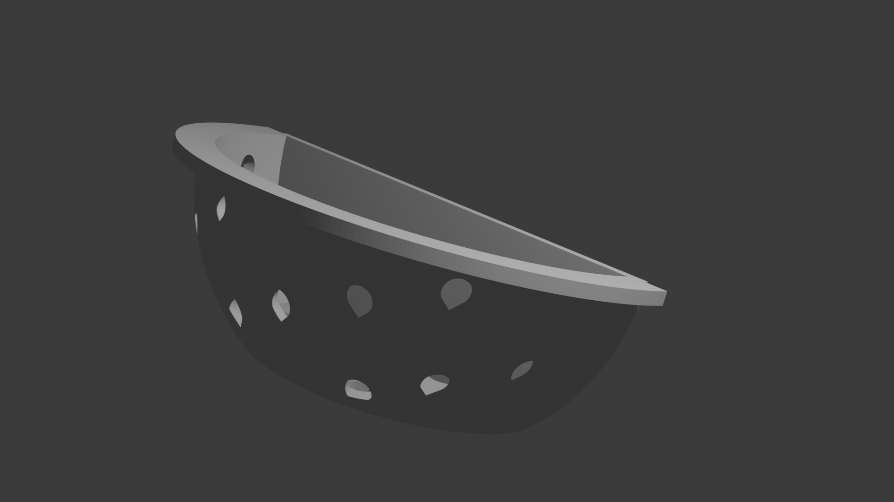
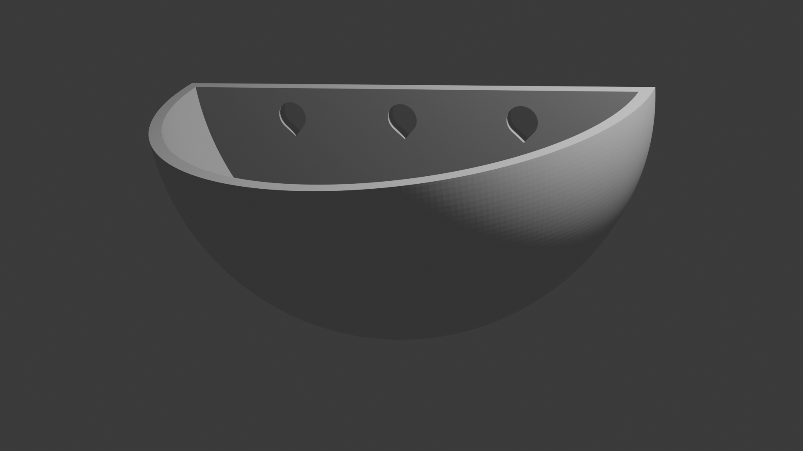

The repo contains [OpenSCAD](https://openscad.org/) files for the following models:

## pot.stl

A 3D printable customizable pot liner for semi-hydro plants.

### Images

 

### Print Info

The pots can be printed on bottom or standing on their rim. If printed on the base with no legs
there should be no need for support. In every other configuration support is needed.

### Examples

#### Coffee Mug Semi-Hydro

`./media/coffe_mug_hydro.stl`

```openscad

odTop = 75;
odBottom = 75;
idTop = 72;
idBottom = 72;
cupHeight = 93;
baseHeight = 3;

legLength= 0;
legDiam= odTop/10;
legCount = 10;
legDistToCenter = .8;

holeRadius = 4;
holeOffset = 1;
numberOfHoles = 23;
numberOfCols= 10;
angleOffset = 19;
holeDirection = true;

lipRim = 10;
lipThickness = 5;

bottomOffset = holeRadius*3;
bottomHoleRowCount = 5;

MAX = 256;
```

#### Coffee Mug Soil

`./media/coffe_mug_soil.stl`

```openscad
odTop = 75;
odBottom = 75;
idTop = 72;
idBottom = 72;
cupHeight = 93;
baseHeight = 3;

legLength= 0;
legDiam= odTop/10;
legCount = 10;
legDistToCenter = .8;

holeRadius = 2;
holeOffset = 1;
numberOfHoles = 0;
numberOfCols= 0;
angleOffset = 19;
holeDirection = true;

lipRim = 10;
lipThickness = 5;

bottomOffset = holeRadius*3;
bottomHoleRowCount = 9;

MAX = 256;


```

## wallpot.stl

A 3D printable customizable half hemisphere pot and liner for semi-hydro plants.

### Images

 

### Print Info

The pots can be printed on their sides or standing on their rim. In either orientation the print
will need some supports. I have found slim trees to work well. The teardrops should have their
points pointing away from the build plate if possible.
